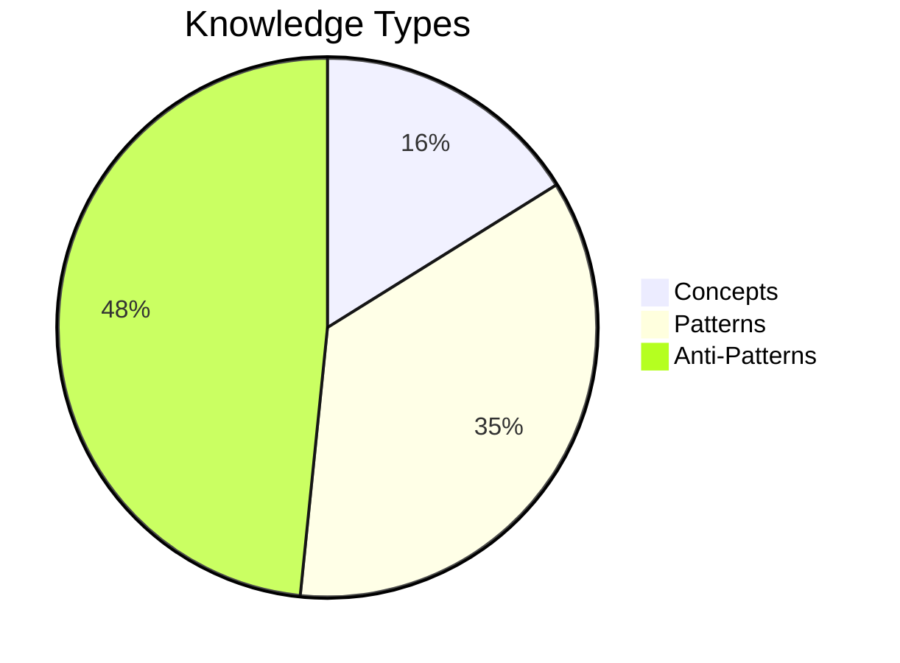

# 🩺 Wiki Health Report (2026-09-02)

> `doc/wiki/` 루트가 아니라 `reports/` 에 둔다. 인덱서는 루트의 loose `.md` 를
> 태그로 분류하는데 `report` 태그는 분류 대상이 아니라 **Concepts 로 떨어져
> 개념 수를 부풀린다**(실제로 4→5 가 됐다). 통계를 오염시키지 않는 자리에 둔다.

첫 컴파일. `doc/raw/2026-09-01.md`·`2026-09-02.md` 의 Case 1~11 을 지식 페이지 31장으로 승격했다.

## 📊 Knowledge Distribution

| 상태 | 수 |
|---|---|
| active | 31 |
| draft | 1 |
| deprecated | 0 |

`draft` 는 [[tolerant-decode-with-preservation]] 하나다 — 규칙은 정해졌으나 **아직 코드에 적용되지 않았다.** 적용 시점은 "앱 버전이 둘 이상 도는 시점 직전"이고, 그 뒤에는 늦다.

## ⚠️ Critical Issues

- **Broken Links**: 없음
- **Evidence Violations**: 없음 (모든 `hash:` 참조와 Error 인용이 `doc/raw/` 에서 verbatim 확인됨)
- **Version Drift**: 없음
- **Conflicts**: 없음

## 🔗 지식 그래프의 축

이번 컴파일에서 드러난 것은, 겉보기에 무관한 실패들이 **세 개의 축**으로 수렴한다는 점이다.

```mermaid
graph TD
    CF[coordinate-frame] --> FPB[frame-provenance-binding]
    CF --> SSWV[server-side-write-verification]
    CF --> UCF([unnamed-coordinate-frame])
    CF --> MIDC([mixed-image-decode-conventions])

    ASY[비동기 경계] --> GT[generation-token]
    ASY --> RCIL([reset-clears-in-flight-lock])
    ASY --> CGTN([contract-guard-too-narrow])

    WSE[wire-schema-evolution] --> RLDT[row-level-decode-tolerance]
    WSE --> TDWP[tolerant-decode-with-preservation]
    WSE --> PRBP([poison-row-blocks-pipeline])
    WSE --> TWP([tolerance-without-preservation])

    CV[canonical-value] --> PUDC([partial-update-desyncs-canonical])
    LQ[live-query] --> FNLQ([frozen-now-in-live-query])
```

- **축 1 — 좌표계**: 좌표는 프레임 없이 의미가 없다. 라벨 파손 두 종류(배율/회전)와 EXIF 관례 불일치가 전부 여기 붙는다.
- **축 2 — 비동기 경계**: `await` 하나마다 "그 사이에 무엇이든 일어난다"는 구멍이 생긴다. 라벨러의 `lb.gen` 과 스캐너의 `_session` 은 **같은 처방**이고, 스로틀러 잠금은 그 처방이 못 덮는 남은 층이다.
- **축 3 — 버전 공존**: 스키마가 하나뿐인 동안에는 절대 안 터지고, 출시 후에만 터진다. 그래서 관측이 아니라 **규율**로 막아야 한다.

## 🔁 반복 신호

같은 실수가 두 번 이상 나타난 자리 — GLM/에이전트 작업 전에 먼저 볼 것.

| 신호 | 나타난 곳 |
|---|---|
| "지금 호출부는 늘 그렇게 부른다"에 기댄 계약 | Case 9 ×3 (부분 수정 / 좁은 try / reset) |
| 좌표를 저장하면서 프레임을 안 남김 | Case 3, Case 6, Case 7 |
| 관용이 곧 파괴가 되는 기본값 치환 | Case 10 (tag/source) |
| 경계 검사 통과를 정답으로 오인 | Case 7 |

## 🛠️ Auto-Fix Summary

- [x] `doc/wiki/anti-patterns/` → `antipatterns/` 로 이름 변경 (인덱서가 하이픈 없는 디렉터리만 스캔한다)
- [x] Case 6 Grounding 에 `hash:474da30` 추가 — 위키가 인용하던 해시가 raw 에 없어 evidence violation 2건이 떴다
- [x] `llm-wiki compile index` 로 인덱스·통계 재생성

## 다음 컴파일에서 볼 것

1. [[tolerant-decode-with-preservation]] 가 `draft` → `active` 로 갈 수 있는가 (enum 3종 정책 통일 여부)
2. [[mixed-image-decode-conventions]] 의 미완 항목 — `build_cache_v2`·`detect_datumo_gm`·`golden_bench`(Dart) EXIF 로더 통일
3. `Answers` 섹션이 비어 있다 — 반복 질문이 쌓이면 승격 대상
4. **검색 도달성 재측정** — 새 페이지를 쓸 때마다 `llm-wiki search "<식별자>"` 로
   실제로 걸리는지 확인한다([[wiki-unreachable-by-identifier]] 체크리스트)
